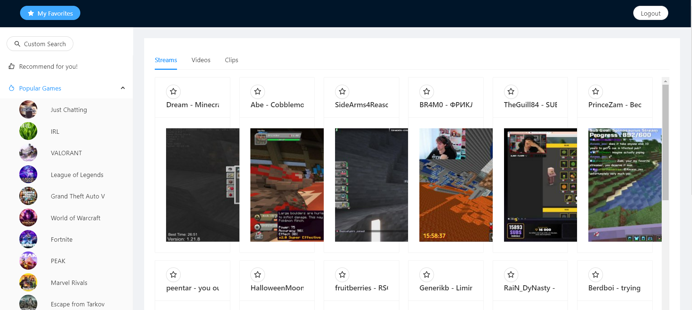
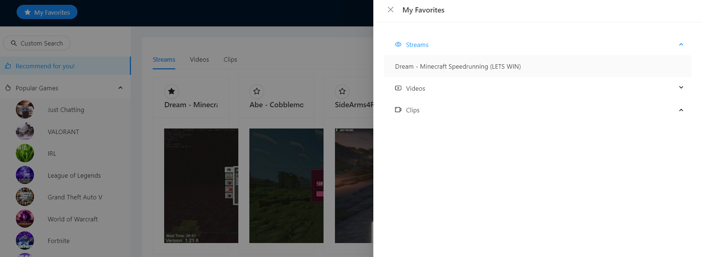

---

# Twitch FE React

这是一个使用 React 构建的 Twitch 前端项目，旨在复刻 Twitch.tv 的核心用户界面和功能。项目通过调用 Twitch API 来获取真实的直播、用户和游戏数据，为用户提供一个流畅、响应式的浏览体验。

## ✨ 项目特色

*   **现代化的技术栈**: 使用 React、React Router 和 CSS Modules 构建，保证了代码的可维护性和可扩展性。
*   **响应式设计**: 无论是桌面、平板还是手机，都能获得一致且友好的用户体验。
*   **真实数据**: 集成 Twitch API，动态展示热门直播、关注频道和游戏分类。
*   **组件化开发**: 采用原子设计理念，将 UI 拆分为独立、可复用的组件。
*   **简洁的导航**: 实现了左侧折叠导航栏和顶部搜索栏，方便用户快速发现内容。

## 🚀 快速开始

请确保你的电脑上已经安装了 Node.js (>= 16.0.0) 和 npm 或 yarn。

### 1. 克隆项目

```bash
git clone https://github.com/QuantumBitstream/twitchfe.git
cd twitch-fe-react
```

### 2. 安装依赖

使用 npm:
```bash
npm install
```
或者使用 yarn:
```bash
yarn install
```

### 3. 配置环境变量

为了能成功调用 Twitch API，你需要一个 Twitch 应用的 Client ID 和 App Access Token。

1.  访问 [Twitch Developers Console](https://dev.twitch.tv/console) 并注册一个新应用。
2.  获取你的 `Client ID`。
3.  生成一个 `App Access Token`。
4.  在项目根目录下创建一个 `.env` 文件，并填入你的凭证：

   ```env
   REACT_APP_TWITCH_CLIENT_ID=你的Client_ID
   REACT_APP_TWITCH_ACCESS_TOKEN=你的App_Access_Token
   ```

> **注意**: `.env` 文件已被添加到 `.gitignore` 中，以防止你的敏感信息被上传到 Git 仓库。

### 4. 运行项目

```bash
npm start
```
或者
```bash
yarn start
```

项目将会在 `http://localhost:3000` 上运行。打开浏览器访问该地址即可看到效果。

## 🛠️ 技术栈

*   **[React](https://reactjs.org/)**: 用于构建用户界面的核心库。
*   **[React Router](https://reactrouter.com/)**: 处理应用的客户端路由。
*   **[Axios](https://axios-http.com/)**: 用于发起 HTTP 请求，与 Twitch API 进行交互。
*   **[CSS Modules](https://github.com/css-modules/css-modules)**: 实现组件级别的 CSS 作用域，避免样式冲突。
*   **[React Icons](https://react-icons.github.io/react-icons/)**: 提供丰富的 SVG 图标库。

## 📂 项目结构

```
twitch-fe-react/
├── public/                # 静态资源
├── src/
│   ├── api/               # API 请求相关模块 (e.g., twitchApi.js)
│   ├── assets/            # 图片、字体等资源
│   ├── components/        # 可复用的UI组件 (e.g., Button, LiveStreamCard)
│   ├── hooks/             # 自定义 React Hooks
│   ├── pages/             # 页面级组件 (e.g., Home, Browse, Following)
│   ├── styles/            # 全局样式和变量
│   ├── App.js             # 应用根组件
│   ├── index.js           # 应用入口文件
│   └── ...
├── .env                   # 环境变量 (本地)
├── .gitignore             # Git 忽略文件
├── package.json           # 项目依赖和脚本
└── README.md              # 项目说明文档
```

## 📸 项目截图


**首页:**


**详情页:**


## 🤝 如何贡献

欢迎对这个项目做出贡献！你可以通过以下方式参与：

1.  **Fork** 这个仓库。
2.  创建一个新的分支 (`git checkout -b feature/AmazingFeature`)。
3.  提交你的代码 (`git commit -m 'Add some AmazingFeature'`)。
4.  将你的分支推送到远程仓库 (`git push origin feature/AmazingFeature`)。
5.  提交一个 **Pull Request**。

请确保你的代码遵循现有的代码风格，并提供清晰的提交信息。

## 📜 开源许可

该项目基于 [Apache 2.0](https://opensource.org/licenses/apache-2-0) 开源。

---


